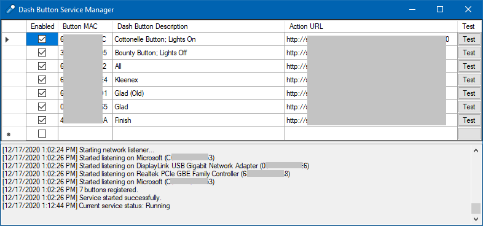

#  Dash Button Manager

A tool, a service, and a library to trigger custom, user defined actions upon pressing an Amazon Dash Button.

Requires WinPcap to be installed on your computer for the tool to work. It can be downloaded here: https://winpcap.org

## Configuring a Dash Button

**IMPORTANT:** Make sure you do the following in an environment without internet connection.

1. Long press the button until a blue light turns on
2. Connect to Amazon ConfigureMe WiFi
3. Go to http://192.168.0.1
4. Get the displayed MAC address of the button
5. Block the MAC address in your home/office router's firewall
6. Long press the button again
7. Connect to Amazon ConfigureMe WiFi again
8. Go to http://192.168.0.1/?amzn_ssid={SSID}&amzn_pw={Password} (replace {SSID} and {Password} with your WiFi name and password)

If the above instructions do not work, try the original instructions: https://blog.christophermullins.com/2019/12/20/rescue-your-amazon-dash-buttons

## How It Works

When a button is pressed, it sends multiple broadcast Address Resolution Protocol (ARP) requests over the network to find the IP addresses of the default gateway, the DNS server(s), etc. The program listens on all the network interfaces of the computer for these ARP packets and triggers the user-defined actions based on the received ARP requester MAC address - which represents the MAC address of the dash button.

Read more about ARP here: https://en.wikipedia.org/wiki/Address_Resolution_Protocol

## Dash Button Service vs. Dash Button Manager

| Dash Button Service \(Recommended\)                        | Dash Button Manager                     |
|------------------------------------------------------------|-----------------------------------------|
| Needs to be installed                                      | Can be run directly                     |
| Runs as a service in the background                        | A user must be logged in for it to work |
| Administrative rights are needed to add and modify buttons | No administrative rights are needed*    |

\*Administrative rights are needed to install WinPcap if not already installed.

## Screenshots

### Dash Button Service Manager

### Dash Button Manager

